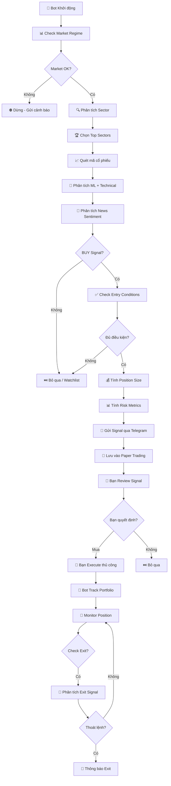

# 🤖 TRADING BOT - LUỒNG HOẠT ĐỘNG

## 📌 LƯU Ý QUAN TRỌNG

**Bot này là Signal Generator & Notification System**
- ✅ Bot phân tích và gửi tín hiệu qua Telegram
- ✅ Bạn quyết định có mua/bán hay không
- ✅ Bạn execute orders thủ công qua broker app
- ❌ Bot KHÔNG tự động trade

---

## 🔄 LUỒNG CHÍNH

---

## 📋 CHI TIẾT TỪNG BƯỚC

### 1. **Market Check** 📊
- Phân tích market regime (BULL/BEAR/SIDEWAYS)
- Kiểm tra điều kiện giao dịch
- Nếu không OK → Dừng và cảnh báo

### 2. **Sector Analysis** 🔍
- Phân tích tất cả sectors
- Chọn top sectors dựa trên:
  - ML signals quality
  - Volume & Liquidity
  - Volatility
  - Relative strength
  - Correlation (tránh sectors tương quan cao)

### 3. **Stock Scanning** 📈
- Quét các mã trong top sectors
- Load dữ liệu với incremental cache
- API monitoring với retry

### 4. **ML Analysis** 🤖
- Ensemble models: RandomForest + XGBoost + LSTM
- Technical indicators: RSI, MACD, ATR, Bollinger Bands
- Feature engineering với rolling windows
- Confidence scoring

### 5. **News Sentiment** 📰
- Phân tích tin tức với PhoBERT/ViBERT
- Topic classification (dividend, litigation, macro, earnings)
- Sentiment scoring
- Hot news detection

### 6. **Entry Logic** ✅
- Kiểm tra điều kiện entry:
  - ML signal BUY + confidence ≥ threshold
  - Trend alignment
  - Support/resistance
  - Volume confirmation
  - News sentiment
- Tính stop-loss và take-profit

### 7. **Position Sizing** 💰
- Conservative position sizing:
  - Risk per trade (2% vốn)
  - Max position size (10% vốn)
  - Volatility adjustment
  - Diversification check
  - Sector exposure limits

### 8. **Risk Metrics** 📊
- Sector exposure analysis
- Correlation matrix
- Portfolio diversification score
- Overweight sector warnings

### 9. **Telegram Notification** 📱
- Gửi signal với:
  - Symbol, confidence, reasons
  - Entry price, stop-loss, take-profit
  - Position size, risk metrics
  - News sentiment
  - Sector exposure warnings

### 10. **Paper Trading** 💾
- Tự động execute trong paper account
- Track PnL và performance
- So sánh với real portfolio

### 11. **User Decision** 👤
- **Bạn review signal** → Xem confidence, reasons, risk
- **Bạn quyết định** → Mua/không mua
- **Bạn execute thủ công** → Qua broker app (TCBS, VPS, SSI)

### 12. **Portfolio Tracking** 💼
- Bot track portfolio nếu bạn add stocks
- Tính PnL theo ngày
- Equity curve
- Performance metrics
- Risk analysis

### 13. **Exit Monitoring** 🔄
- Check exit conditions:
  - Stop-loss hit
  - Take-profit reached
  - ML SELL signal
  - Market regime change
  - News sentiment negative
- Gửi thông báo exit nếu cần

---

## ⏰ SCHEDULE

### Giờ giao dịch VN (9:00-11:30, 13:00-15:00, trừ T3/T7)

- **9:15** - Quét tín hiệu (sau khi mở cửa 15 phút)
- **9:30, 13:30, 14:30** - Refresh tin tức
- **14:45** (Thứ 6) - Kiểm tra portfolio
- **15:10** - Record PnL hàng ngày
- **15:15** - Gửi daily summary
- **20:00** (Thứ 7) - Phân tích sector tuần

---

## 🔄 WORKFLOW HÀNG NGÀY

1. **Bot quét thị trường** → Phân tích ML + Technical + Sentiment
2. **Bot gửi signals qua Telegram** → Với đầy đủ thông tin
3. **Bạn nhận notification** → Review signals
4. **Bạn quyết định** → Mua/không mua dựa trên bot + phân tích của bạn
5. **Bạn execute thủ công** → Qua broker app
6. **Bot track portfolio** → Nếu bạn add stocks vào bot
7. **Bot monitor exits** → Gửi thông báo khi cần thoát

---

## 📊 FEATURES

### Signal Generation
- ✅ ML ensemble models
- ✅ Technical analysis
- ✅ News sentiment
- ✅ Sector analysis
- ✅ Risk metrics

### Portfolio Management
- ✅ Track holdings
- ✅ PnL tracking
- ✅ Equity curve
- ✅ Performance metrics
- ✅ Risk analysis

### Paper Trading
- ✅ Simulate trades
- ✅ Track performance
- ✅ Compare với real portfolio

### Notifications
- ✅ Telegram signals
- ✅ Daily summaries
- ✅ Portfolio updates
- ✅ News alerts
- ✅ Exit signals

---

## ⚠️ LƯU Ý

- Bot chỉ gửi signals, không tự động trade
- Bạn vẫn là người quyết định cuối cùng
- Luôn có risk management riêng
- Bot signals chỉ là tham khảo, không phải lúc nào cũng đúng
