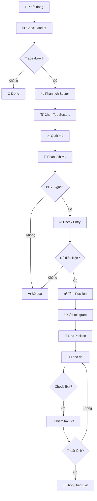

# 🤖 TRADING BOT - LUỒNG HOẠT ĐỘNG

## 🔄 LUỒNG CHÍNH

```mermaid
graph TD
    A[🚀 Khởi động] --> B[📊 Check Market]
    B --> C{Trade được?}
    C -->|Không| D[⛔ Dừng]
    C -->|Có| E[🔍 Phân tích Sector]
    E --> F[🏆 Chọn Top Sectors]
    F --> G[📈 Quét mã]
    G --> H[🤖 Phân tích ML]
    H --> I{BUY Signal?}
    I -->|Không| J[⏭️ Bỏ qua]
    I -->|Có| K[✅ Check Entry]
    K --> L{Đủ điều kiện?}
    L -->|Không| J
    L -->|Có| M[💰 Tính Position]
    M --> N[📱 Gửi Telegram]
    N --> O[💾 Lưu Position]
    O --> P[🔄 Theo dõi]
    P --> Q{Check Exit?}
    Q -->|Có| R[🎯 Kiểm tra Exit]
    R --> S{Thoát lệnh?}
    S -->|Có| T[📱 Thông báo Exit]
    S -->|Không| P
```
